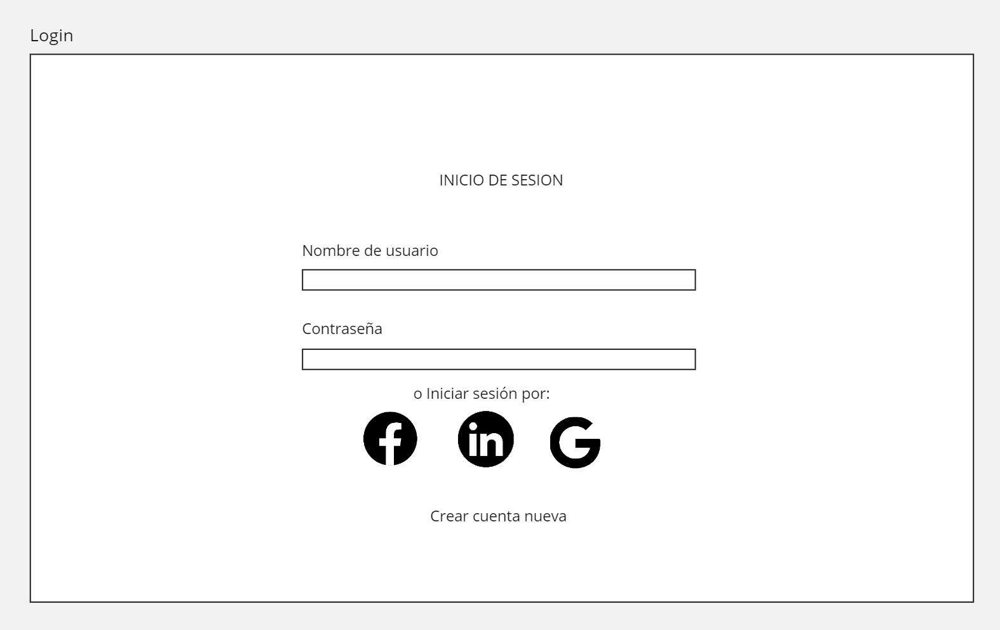
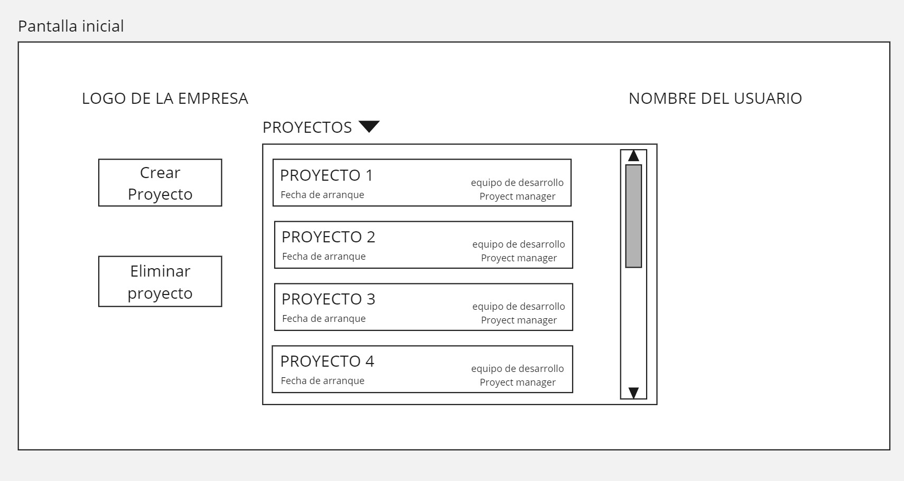
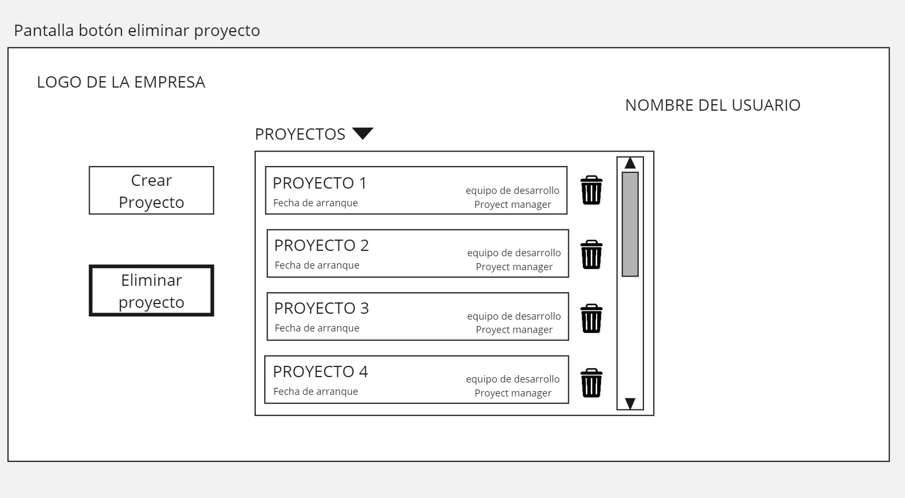
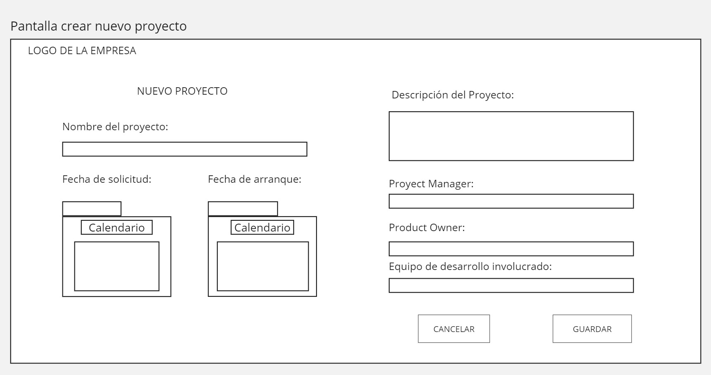
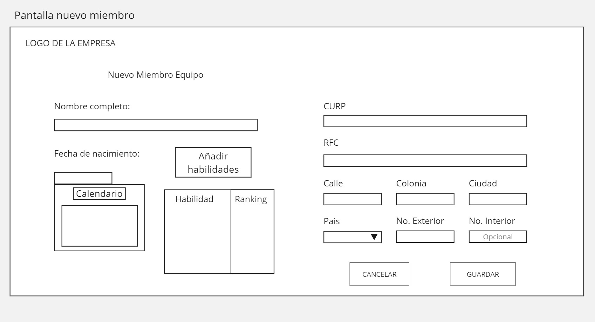

# Proyecto reto I: Desarrollar un manejador de proyectos

Para el primer parcial se evaluara lo siguiente:

1) Estructura del proyecto (10 puntos).

2) Diagrama de clases que cubra todos los requerimientos solicitados (20 puntos).

3) Todas las rutas necesarias para que el proyecto funcione con base al modelo REST (20 puntos).

4) Wireframes del flujo del proyecto (20 puntos).

5) Diagrama de interacción que explique el flujo según los requerimientos. (20 puntos).

6) Imagen de Docker funcional en docker hub (10 puntos).

## Iniciando

Para testear el proyecto puedes usar el siguiente comando
```
npm start
```

### Instalando 

Usa el siguiente comando para clonar el repo son ssh:

```
git clone git@gitlab.com:a358193/manejador-proyectos.git
```

### Wireframes 

Para mayor comprension de la estructura basado en los requerimientos especificados en el documento anexado a la asignacion de este proyecto, aqui se muestran los debidos wireframes:












## Autores

* **Emiliano Rivera     358193**

* **Erick Nevarez     357664**