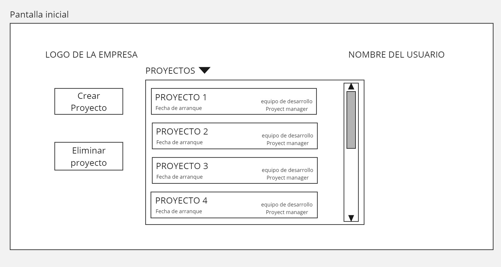
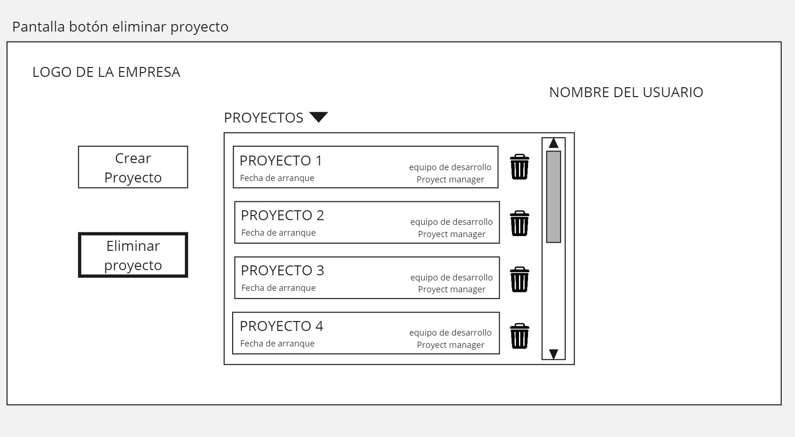
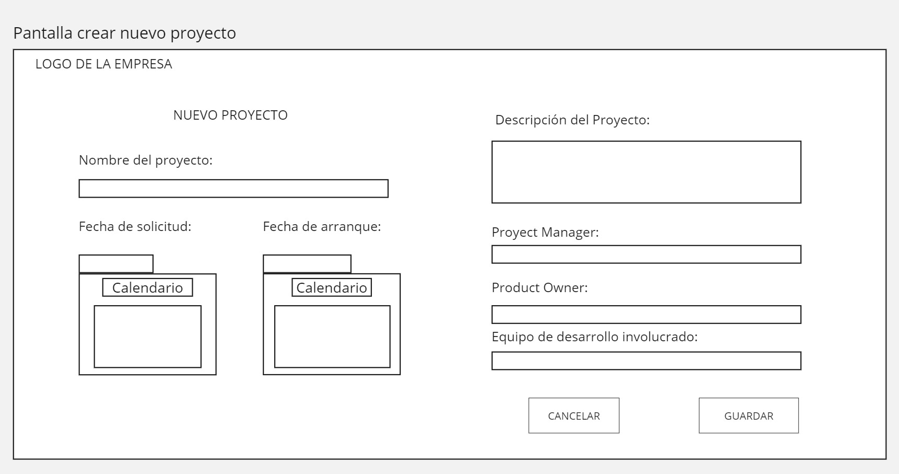
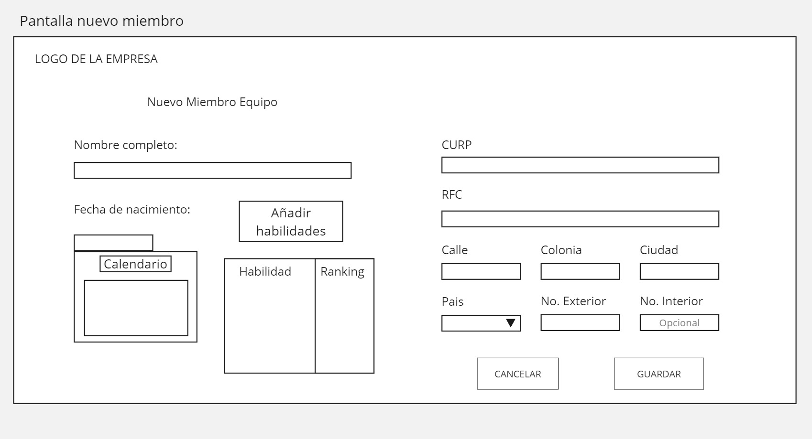

# Proyecto reto I: Desarrollar un manejador de proyectos

Para el primer parcial se evaluara lo siguiente:

1) Estructura del proyecto (10 puntos).

2) Diagrama de clases que cubra todos los requerimientos solicitados (20 puntos).

3) Todas las rutas necesarias para que el proyecto funcione con base al modelo REST (20 puntos).

4) Wireframes del flujo del proyecto (20 puntos).

5) Diagrama de interacción que explique el flujo según los requerimientos. (20 puntos).

6) Imagen de Docker funcional en docker hub (10 puntos).

## Iniciando

Para testear el proyecto puedes usar el siguiente comando
```
npm start
```

### Instalación

#### Mediante SSH

Usa el siguiente comando para clonar el repo con ssh:

```
git clone git@gitlab.com:a358193/manejador-proyectos.git
```

#### Mediante Docker

El proyecto se encuentra disponible [a través de Dockerhub](https://hub.docker.com/r/hecmeduach/administrador-de-proyectos)

El comando para su instalación en Docker es:
```
docker pull hecmeduach/administrador-de-proyectos
```

### Wireframes 

Para mayor comprensión de la estructura basado en los requerimientos especificados en el documento anexado a la asignación de este proyecto, aquí se muestran los debidos wireframes:










### Diagrama de clases

De igual forma proporcionamos el diagrama de clases de la aplicación.


## Autores

* **Emiliano Rivera     358193**

* **Erick Nevarez     357664**

* **Gerardo Jurado  273880**  

* **Héctor Medrano      361345**